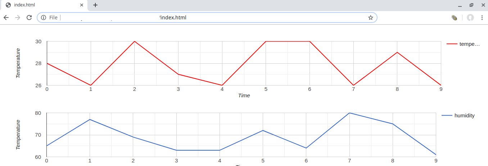

# Temperature and Humidity stored on the IOTA Tangle with a Webduino Smart

## Introduction
This code works best with the [Webduino Smart](https://store.webduino.io/products/webduino-smart) and an [temperature and humidity sensor](https://tutorials.webduino.io/zh-tw/docs/basic/sensor/dht.html) to build a simple blockchain IoT environmental sensor demonstration.

Temperature and humidity data issue from the sensors and store in IOTA Tangle every one hour in [send.html](send.html) file,then fetch all data from IOTA Tangle and visualize as a line chart in [index.html](index.html) file. 

## Architecture

## Prepare
- Hardware
  - [Webduino Smart](https://store.webduino.io/products/webduino-smart) 
  - [Temperature and humidity sensor](https://tutorials.webduino.io/zh-tw/docs/basic/sensor/dht.html)
- Software
  - [Tangle-accelerator](https://github.com/DLTcollab/tangle-accelerator)
    - You can issue and fetch the data by a public IOTA full node directly, but Tangle-accelerator provides:
      - An IOTA permanode for public usage;
      - Load-balancers to interact full nodes providing blockchain-based services;
      - Hardware-accelerated caching proxy service for extremely fast blockchain transaction, especially for lookup and batched data manipulation;
      - The APIs is ideal for the use scenarios of Proof-of-Existence(PoE) and Decentralized Identifiers (DIDs);

## Data Visualization

